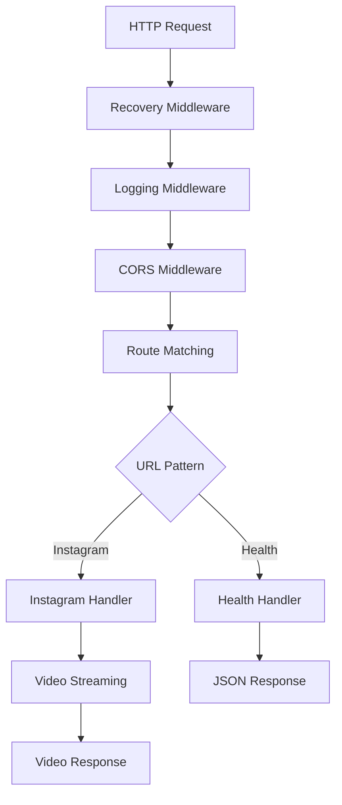

# 🌐 HTTP Server

This document explains the HTTP server component, responsible for handling HTTP requests, routing, and response formatting for privacy-focused content viewing.

## 🎯 **Overview**

The HTTP server is the entry point for all privacy-focused client requests, providing:

- **HTTP Request Routing** - URL pattern matching and handler dispatch
- **Privacy Middleware Chain** - Request processing pipeline with privacy considerations
- **Response Formatting** - Proper HTTP responses and headers
- **Graceful Shutdown** - Clean server termination
- **Health Monitoring** - Server health and metrics endpoints
- **No Data Collection** - Ensures user requests don't contribute to tracking

## 🏗️ **Architecture**

### **Component Structure**

```
internal/server/
├── server.go     # Server setup, lifecycle, and routing
└── handlers.go   # Individual HTTP request handlers
```

### **Core Interface**

```go
type Server struct {
    config          *config.Config
    instagramClient *instagram.Client
    logger          *slog.Logger
    httpServer      *http.Server
}

// Main API
func New(cfg *config.Config, client *instagram.Client, logger *slog.Logger) *Server
func (s *Server) Start(ctx context.Context) error
```

## 🔄 **Request Flow**

### **1. Request Processing Pipeline**



### **2. Middleware Chain**

```go
// Middleware application order (important!)
mux.HandleFunc("/api/", recovery(logging(cors(actualHandler))))

// Processing order: Recovery → Logging → CORS → Handler
```

## 📋 **Core Functions**

### **Server Initialization**

```go
func New(cfg *config.Config, client *instagram.Client, logger *slog.Logger) *Server {
    return &Server{
        config:          cfg,
        instagramClient: client,
        logger:          logger,
    }
}
```

### **Server Lifecycle Management**

```go
func (s *Server) Start(ctx context.Context) error {
    // Create HTTP server
    mux := s.setupRoutes()
    s.httpServer = &http.Server{
        Addr:         ":" + s.config.Server.Port,
        Handler:      mux,
        ReadTimeout:  s.config.Server.ReadTimeout,
        WriteTimeout: s.config.Server.WriteTimeout,
        IdleTimeout:  s.config.Server.IdleTimeout,
    }

    // Start server in background
    go func() {
        if err := s.httpServer.ListenAndServe(); err != http.ErrServerClosed {
            s.logger.Error("Server failed to start", "error", err)
        }
    }()

    // Wait for shutdown signal
    <-ctx.Done()

    // Graceful shutdown
    return s.gracefulShutdown()
}
```

### **Route Configuration**

```go
func (s *Server) setupRoutes() *http.ServeMux {
    mux := http.NewServeMux()

    // Health check endpoint
    mux.HandleFunc("/health", s.chainMiddleware(s.handleHealthCheck))

    // Root information endpoint
    mux.HandleFunc("/", s.chainMiddleware(s.handleRoot))

    // Instagram URL patterns
    mux.HandleFunc("/reel/", s.chainMiddleware(s.handleReel))

    return mux
}
```

### **Middleware Chaining**

```go
func (s *Server) chainMiddleware(handler http.HandlerFunc) http.HandlerFunc {
    // Chain middleware in correct order
    return middleware.RecoveryMiddleware(s.logger)(
        middleware.LoggingMiddleware(s.logger)(
            middleware.CORSMiddleware(handler)))
}
```

## 🎯 **Request Handlers**

### **Health Check Handler**

```go
func (s *Server) handleHealthCheck(w http.ResponseWriter, r *http.Request) {
    w.Header().Set("Content-Type", "application/json")
    w.WriteHeader(http.StatusOK)

    response := map[string]interface{}{
        "status":    "healthy",
        "timestamp": time.Now().Format(time.RFC3339),
        "version":   "1.0.0",
    }

    json.NewEncoder(w).Encode(response)
}
```

### **Root Information Handler**

```go
func (s *Server) handleRoot(w http.ResponseWriter, r *http.Request) {
    w.Header().Set("Content-Type", "text/html")

    html := fmt.Sprintf(`
    <!DOCTYPE html>
    <html>
    <head>
        <title>Qwiklip</title>
        <style>
            body { font-family: Arial, sans-serif; margin: 40px; }
            .container { max-width: 800px; margin: 0 auto; }
            .example { background: #f5f5f5; padding: 15px; border-radius: 5px; margin: 10px 0; }
            code { background: #e0e0e0; padding: 2px 4px; border-radius: 3px; }
        </style>
    </head>
    <body>
        <div class="container">
            <h1>Qwiklip</h1>
            <p>Access Instagram videos through Qwiklip.</p>
            <!-- Usage examples -->
        </div>
    </body>
    </html>`, s.config.Server.Port)

    fmt.Fprint(w, html)
}
```

### **Instagram Video Handler**

```go
func (s *Server) handleReel(w http.ResponseWriter, r *http.Request) {
    // Extract Instagram URL from request path
    requestPath := strings.TrimPrefix(r.URL.Path, "/")
    instagramURL := fmt.Sprintf("https://www.instagram.com/%s", requestPath)

    // Get media information
    mediaInfo, err := s.instagramClient.GetMediaInfo(instagramURL)
    if err != nil {
        s.handleError(w, err)
        return
    }

    // Stream video content
    s.streamVideo(w, r, mediaInfo.VideoURL, mediaInfo.FileName)
}
```

## 🎬 **Video Streaming**

### **Video Stream Handler**

```go
func (s *Server) streamVideo(w http.ResponseWriter, r *http.Request, videoURL, fileName string) {
    // Create request to Instagram CDN
    req, err := http.NewRequestWithContext(r.Context(), "GET", videoURL, nil)
    if err != nil {
        s.handleError(w, err)
        return
    }

    // Set browser-like headers
    s.setVideoHeaders(req, r)

    // Make request
    resp, err := s.instagramClient.GetHTTPClient().Do(req)
    if err != nil {
        s.handleError(w, err)
        return
    }
    defer resp.Body.Close()

    // Validate response
    if resp.StatusCode < 200 || resp.StatusCode >= 300 {
        s.handleHTTPError(w, resp.StatusCode)
        return
    }

    // Set response headers
    s.setResponseHeaders(w, resp)

    // Stream content to client
    s.streamContent(w, resp.Body)
}
```

### **HTTP Headers Management**

```go
func (s *Server) setVideoHeaders(req *http.Request, originalRequest *http.Request) {
    // Browser-like headers
    req.Header.Set("User-Agent", s.config.Instagram.UserAgent)
    req.Header.Set("Accept", "*/*")
    req.Header.Set("Accept-Language", "en-US,en;q=0.9")
    req.Header.Set("Referer", "https://www.instagram.com/")

    // Forward Range header for partial content
    if rangeHeader := originalRequest.Header.Get("Range"); rangeHeader != "" {
        req.Header.Set("Range", rangeHeader)
    }
}

func (s *Server) setResponseHeaders(w http.ResponseWriter, resp *http.Response) {
    // Content headers
    w.Header().Set("Content-Type", "video/mp4")
    w.Header().Set("Accept-Ranges", "bytes")

    // Size and range headers
    if contentLength := resp.Header.Get("Content-Length"); contentLength != "" {
        w.Header().Set("Content-Length", contentLength)
    }

    if contentRange := resp.Header.Get("Content-Range"); contentRange != "" {
        w.Header().Set("Content-Range", contentRange)
    }

    // Set appropriate status code
    if resp.StatusCode == http.StatusPartialContent {
        w.WriteHeader(http.StatusPartialContent)
    } else {
        w.WriteHeader(http.StatusOK)
    }
}
```

## 🛡️ **Error Handling**

### **Error Response Handler**

```go
func (s *Server) handleError(w http.ResponseWriter, err error) {
    var appErr *models.AppError
    if errors.As(err, &appErr) {
        s.sendErrorResponse(w, appErr.HTTPStatusCode(), appErr.Message)
        s.logger.Error("Request failed",
            "error", appErr.Message,
            "type", appErr.Type,
            "status", appErr.HTTPStatusCode())
        return
    }

    // Generic error
    s.sendErrorResponse(w, http.StatusInternalServerError, "Internal server error")
    s.logger.Error("Unexpected error", "error", err)
}

func (s *Server) sendErrorResponse(w http.ResponseWriter, statusCode int, message string) {
    w.Header().Set("Content-Type", "application/json")
    w.WriteHeader(statusCode)

    response := map[string]string{
        "error":   message,
        "status":  http.StatusText(statusCode),
        "code":    statusCode,
    }

    json.NewEncoder(w).Encode(response)
}
```

## 📊 **Performance Optimizations**

### **Connection Pooling**

```go
// HTTP client with optimized settings
httpClient := &http.Client{
    Timeout: s.config.Instagram.Timeout,
    Transport: &http.Transport{
        MaxIdleConns:        100,
        MaxIdleConnsPerHost: 10,
        IdleConnTimeout:     90 * time.Second,
    },
}
```

### **Streaming Optimization**

```go
func (s *Server) streamContent(w http.ResponseWriter, body io.ReadCloser) {
    buffer := make([]byte, 64*1024) // 64KB buffer
    totalBytes := 0

    for {
        n, err := body.Read(buffer)
        if n > 0 {
            if _, writeErr := w.Write(buffer[:n]); writeErr != nil {
                s.logger.Warn("Client disconnected during streaming", "error", writeErr)
                return
            }
            totalBytes += n

            // Log progress for large files
            if totalBytes%(1024*1024) == 0 {
                s.logger.Info("Streaming progress",
                    "bytes_streamed", totalBytes,
                    "mb_streamed", totalBytes/(1024*1024))
            }
        }

        if err != nil {
            if err == io.EOF {
                s.logger.Info("Streaming completed", "total_bytes", totalBytes)
            } else {
                s.logger.Error("Streaming error", "error", err)
            }
            break
        }
    }
}
```

## 🧪 **Testing Strategy**

### **HTTP Handler Tests**

```go
func TestHandleHealthCheck(t *testing.T) {
    server := setupTestServer()

    req := httptest.NewRequest("GET", "/health", nil)
    w := httptest.NewRecorder()

    server.handleHealthCheck(w, req)

    assert.Equal(t, http.StatusOK, w.Code)

    var response map[string]interface{}
    json.Unmarshal(w.Body.Bytes(), &response)

    assert.Equal(t, "healthy", response["status"])
}
```

### **Integration Tests**

```go
func TestServerIntegration(t *testing.T) {
    server := setupTestServer()
    mux := server.setupRoutes()

    // Create test server
    testServer := httptest.NewServer(mux)
    defer testServer.Close()

    // Make HTTP request
    resp, err := http.Get(testServer.URL + "/health")
    require.NoError(t, err)
    defer resp.Body.Close()

    assert.Equal(t, http.StatusOK, resp.StatusCode)
}
```

### **Middleware Tests**

```go
func TestMiddlewareChain(t *testing.T) {
    // Test middleware chain order
    var callOrder []string

    recovery := func(next http.HandlerFunc) http.HandlerFunc {
        return func(w http.ResponseWriter, r *http.Request) {
            callOrder = append(callOrder, "recovery")
            next(w, r)
        }
    }

    logging := func(next http.HandlerFunc) http.HandlerFunc {
        return func(w http.ResponseWriter, r *http.Request) {
            callOrder = append(callOrder, "logging")
            next(w, r)
        }
    }

    handler := func(w http.ResponseWriter, r *http.Request) {
        callOrder = append(callOrder, "handler")
        w.WriteHeader(http.StatusOK)
    }

    // Chain middleware
    chained := recovery(logging(handler))

    // Execute
    req := httptest.NewRequest("GET", "/", nil)
    w := httptest.NewRecorder()
    chained(w, req)

    // Verify execution order
    expected := []string{"recovery", "logging", "handler"}
    assert.Equal(t, expected, callOrder)
}
```

## 📊 **Metrics and Monitoring**

### **Request Metrics**

```go
type ServerMetrics struct {
    RequestsTotal     int64
    RequestsByStatus  map[int]int64
    ResponseTime      time.Duration
    ActiveConnections int64
    BytesServed       int64
}

func (s *Server) recordMetrics(method, path string, statusCode int, duration time.Duration) {
    // Record metrics for monitoring
    // Could integrate with Prometheus, DataDog, etc.
}
```

### **Health Checks**

```go
func (s *Server) healthCheck() map[string]interface{} {
    return map[string]interface{}{
        "status":             "healthy",
        "timestamp":          time.Now().Format(time.RFC3339),
        "uptime":             time.Since(s.startTime).String(),
        "active_connections": s.activeConnections.Load(),
        "version":            "1.0.0",
    }
}
```

## 🚀 **Advanced Features**

### **Rate Limiting**

```go
func (s *Server) rateLimitMiddleware(next http.HandlerFunc) http.HandlerFunc {
    limiter := tollbooth.NewLimiter(10, nil) // 10 requests per second

    return func(w http.ResponseWriter, r *http.Request) {
        httpError := tollbooth.LimitByRequest(limiter, w, r)
        if httpError != nil {
            s.sendErrorResponse(w, http.StatusTooManyRequests, "Rate limit exceeded")
            return
        }
        next(w, r)
    }
}
```

### **Request Timeout**

```go
func (s *Server) timeoutMiddleware(timeout time.Duration) func(http.HandlerFunc) http.HandlerFunc {
    return func(next http.HandlerFunc) http.HandlerFunc {
        return func(w http.ResponseWriter, r *http.Request) {
            ctx, cancel := context.WithTimeout(r.Context(), timeout)
            defer cancel()

            r = r.WithContext(ctx)
            next(w, r)
        }
    }
}
```

### **Graceful Shutdown Enhancement**

```go
func (s *Server) gracefulShutdown() error {
    s.logger.Info("Initiating graceful shutdown")

    // Stop accepting new connections
    ctx, cancel := context.WithTimeout(context.Background(), 30*time.Second)
    defer cancel()

    // Wait for active connections to finish
    if err := s.httpServer.Shutdown(ctx); err != nil {
        s.logger.Error("Server shutdown error", "error", err)
        return err
    }

    s.logger.Info("Server shutdown complete")
    return nil
}
```

## 📚 **Further Reading**

- [HTTP Server in Go](https://golang.org/pkg/net/http/)
- [Context Package](https://golang.org/pkg/context/)
- [HTTP Testing](https://golang.org/pkg/net/http/httptest/)

---

**Next**: Learn about the [error handling](./error-handling.md) system.
