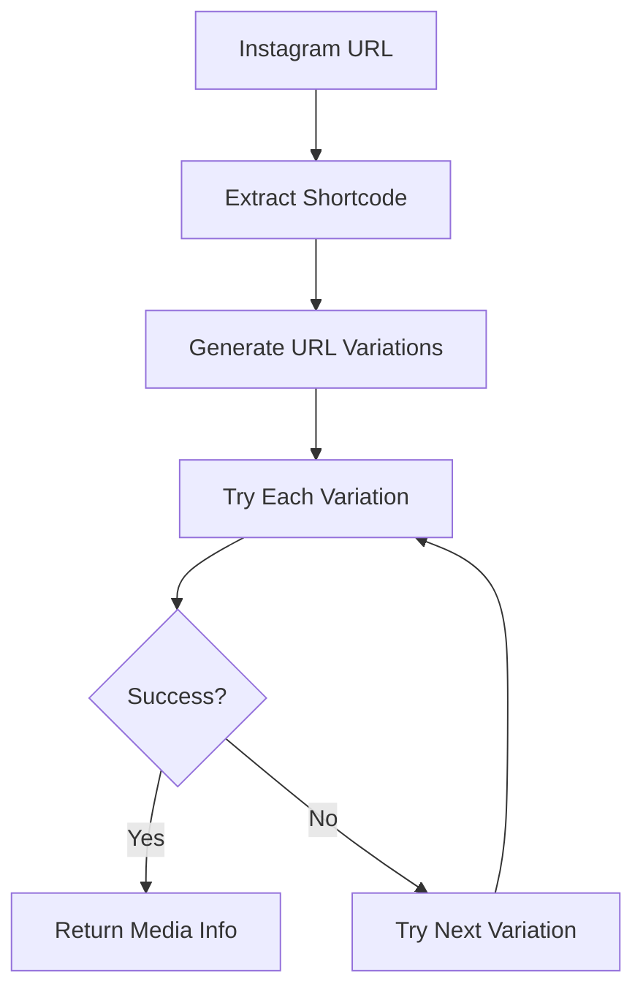
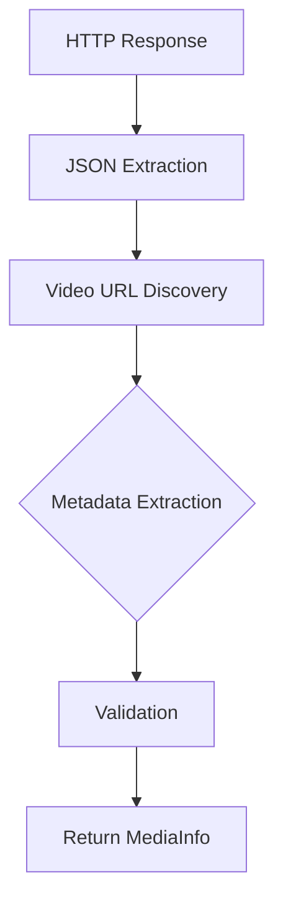

# 📸 Instagram Client

This document explains the Instagram client component, responsible for extracting video information from Instagram URLs with robust fallback mechanisms for privacy-focused content viewing.

## 🎯 **Overview**

The Instagram client is the core privacy-focused component that handles:

- **URL Shortcode Extraction**: Parsing Instagram URLs to extract content identifiers
- **Privacy-First Extraction**: Multiple strategies to access content without revealing user data
- **Video URL Discovery**: Finding actual video URLs from Instagram's responses
- **Data Parsing**: Extracting metadata like usernames, captions, and thumbnails
- **Error Handling**: Comprehensive error handling with custom error types
- **No Tracking**: Ensures requests don't contribute to Instagram's data collection

## 🏗️ **Architecture**

### **Component Structure**

```
internal/instagram/
├── client.go      # Main client API and orchestration
├── extraction.go  # HTML/JSON data extraction logic
└── parser.go      # Data parsing and validation
```

### **Core Interface**

```go
type Client struct {
    httpClient *http.Client
    config     *config.InstagramConfig
    logger     *slog.Logger
}

// Main API
func (c *Client) GetMediaInfo(urlStr string) (*models.InstagramMediaInfo, error)
func (c *Client) ExtractShortcode(urlStr string) (string, error)
```

## 🔄 **Request Flow**

### **1. URL Processing**



### **2. Extraction Strategies**

The client implements multiple extraction strategies to handle Instagram's frequent API changes:

```go
// URL format variations tried
urlFormats := []struct {
    url       string
    userAgent string
}{
    {"https://www.instagram.com/p/{shortcode}/", DesktopUserAgent},
    {"https://www.instagram.com/reel/{shortcode}/", DesktopUserAgent},
    {"https://www.instagram.com/p/{shortcode}/", MobileUserAgent},
    {"https://www.instagram.com/reel/{shortcode}/?__a=1&__d=dis", MobileUserAgent},
}
```

### **3. Data Extraction Pipeline**



## 📋 **Core Functions**

### **GetMediaInfo - Main Entry Point**

```go
func (c *Client) GetMediaInfo(urlStr string) (*models.InstagramMediaInfo, error) {
    // 1. Extract shortcode from URL
    shortcode, err := c.ExtractShortcode(urlStr)
    if err != nil {
        return nil, fmt.Errorf("failed to extract shortcode: %w", err)
    }

    // 2. Try multiple extraction strategies
    for _, strategy := range c.getExtractionStrategies() {
        if mediaInfo := c.tryStrategy(strategy, shortcode); mediaInfo != nil {
            c.logger.Info("Successfully extracted media info",
                "shortcode", shortcode,
                "strategy", strategy.name)
            return mediaInfo, nil
        }
    }

    // 3. Handle failure
    return nil, &models.AppError{
        Type:    models.ErrorTypeExtraction,
        Message: fmt.Sprintf("Failed to extract media info for shortcode: %s", shortcode),
        Details: map[string]interface{}{"shortcode": shortcode},
    }
}
```

### **ExtractShortcode - URL Parsing**

```go
func (c *Client) ExtractShortcode(urlStr string) (string, error) {
    // Validate Instagram URL
    if !strings.Contains(urlStr, "instagram.com") {
        return "", &models.AppError{
            Type:    models.ErrorTypeInvalidURL,
            Message: fmt.Sprintf("Not an Instagram URL: %s", urlStr),
            Details: map[string]interface{}{"url": urlStr},
        }
    }

    // Parse URL
    parsedURL, err := url.Parse(urlStr)
    if err != nil {
        return "", fmt.Errorf("invalid URL: %w", err)
    }

    // Extract shortcode from path
    path := strings.TrimSuffix(parsedURL.Path, "/")
    segments := strings.Split(path, "/")

    // Validate path structure
    if len(segments) >= 3 {
        pathType := segments[len(segments)-2]
        if pathType == "p" || pathType == "reel" || pathType == "tv" {
            return segments[len(segments)-1], nil
        }
    }

    return "", &models.AppError{
        Type:    models.ErrorTypeInvalidURL,
        Message: fmt.Sprintf("Could not extract shortcode from URL: %s", urlStr),
        Details: map[string]interface{}{"url": urlStr},
    }
}
```

## 🎯 **Extraction Strategies**

### **1. JSON Data Extraction**

The client tries multiple patterns to extract JSON data from Instagram's HTML responses:

```go
jsonPatterns := []string{
    `<script type="application/json" data-sjs>(.*?)</script>`,
    `window\.__additionalDataLoaded\('.*?',(.*?)\);`,
    `<script type="text/javascript">window\._sharedData = (.*?);</script>`,
    `window\.__APOLLO_STATE__ = (.*?);</script>`,
    `window\.__INITIAL_DATA__ = (.*?);</script>`,
    `^\{"items":`,  // Direct JSON pattern
}
```

### **2. Direct Video URL Extraction**

Fallback mechanism that searches for video URLs directly in HTML content:

```go
videoPatterns := []string{
    `"https:\/\/instagram\.fbom\d+-\d+\.fna\.fbcdn\.net\/[^"]*\.mp4[^"]*"`,
    `"video_versions":\[\{"width":\d+,"height":\d+,"url":"(https://[^"]+)"`,
    `"video_url":"(https://[^"]+)"`,
    `property="og:video" content="(https://[^"]+)"`,
}
```

### **3. PolarisPostRootQueryRelayPreloader**

Advanced extraction for Instagram's newer page structure:

```go
preloaderPattern := `PolarisPostRootQueryRelayPreloader_[^"]+",(\{"__bbox":\{"complete":true,"result":\{"data":\{"xdt_api__v1__media__shortcode__web_info":\{"items":\[\{[^\}]+\}\]\}\}\}\}\})`
```

## 📊 **Data Structures**

### **InstagramMediaInfo**

```go
type InstagramMediaInfo struct {
    VideoURL     string `json:"videoUrl"`                // Direct video URL
    FileName     string `json:"fileName"`                // Suggested filename
    ThumbnailURL string `json:"thumbnailUrl,omitempty"` // Thumbnail image URL
    Caption      string `json:"caption,omitempty"`       // Post caption
    Username     string `json:"username,omitempty"`      // Author username
}
```

### **Extraction Strategy**

```go
type extractionStrategy struct {
    name        string
    urlTemplate string
    userAgent   string
    parserFunc  func(html string, shortcode string) (*models.InstagramMediaInfo, error)
}
```

## 🔍 **JSON Parsing Logic**

### **1. Structure Detection**

The client detects different Instagram page structures:

```go
func (c *Client) detectStructure(jsonData map[string]interface{}) string {
    // Check for Apollo State structure
    if _, ok := jsonData["ROOT_QUERY"]; ok {
        return "apollo"
    }

    // Check for SharedData structure
    if _, ok := jsonData["entry_data"]; ok {
        return "shareddata"
    }

    // Check for direct items structure
    if _, ok := jsonData["items"]; ok {
        return "direct"
    }

    return "unknown"
}
```

### **2. Video URL Discovery**

Multiple strategies to find video URLs in different JSON structures:

```go
func (c *Client) findVideoURL(jsonData map[string]interface{}) string {
    // Try Apollo State structure
    if videoURL := c.findInApolloState(jsonData); videoURL != "" {
        return videoURL
    }

    // Try SharedData structure
    if videoURL := c.findInSharedData(jsonData); videoURL != "" {
        return videoURL
    }

    // Try direct items structure
    if videoURL := c.findInDirectItems(jsonData); videoURL != "" {
        return videoURL
    }

    return ""
}
```

### **3. Metadata Extraction**

Extracts additional information like username and caption:

```go
func (c *Client) extractMetadata(jsonData map[string]interface{}) (*models.InstagramMediaInfo, error) {
    mediaInfo := &models.InstagramMediaInfo{}

    // Try different metadata extraction patterns
    if username := c.extractUsername(jsonData); username != "" {
        mediaInfo.Username = username
    }

    if caption := c.extractCaption(jsonData); caption != "" {
        mediaInfo.Caption = caption
    }

    if thumbnail := c.extractThumbnail(jsonData); thumbnail != "" {
        mediaInfo.ThumbnailURL = thumbnail
    }

    return mediaInfo, nil
}
```

## 🛡️ **Error Handling**

### **Custom Error Types**

```go
// Network errors
NewNetworkError(operation string, cause error) *AppError

// Extraction errors
NewExtractionError(shortcode string, cause error) *AppError

// Parsing errors
NewParsingError(dataType string, cause error) *AppError

// Rate limiting
NewRateLimitedError(retryAfter string) *AppError
```

### **Error Recovery**

```go
func (c *Client) GetMediaInfo(urlStr string) (*models.InstagramMediaInfo, error) {
    // Try primary extraction
    if mediaInfo, err := c.tryPrimaryExtraction(urlStr); err == nil {
        return mediaInfo, nil
    }

    // Fallback to secondary extraction
    if mediaInfo, err := c.tryFallbackExtraction(urlStr); err == nil {
        c.logger.Warn("Used fallback extraction method")
        return mediaInfo, nil
    }

    // Final fallback to direct HTML parsing
    return c.tryDirectHTMLExtraction(urlStr)
}
```

## 📈 **Performance Optimizations**

### **1. HTTP Client Configuration**

```go
func NewInstagramClient(cfg *config.InstagramConfig, logger *slog.Logger) *Client {
    return &Client{
        httpClient: &http.Client{
            Timeout: cfg.Timeout,
            Transport: &http.Transport{
                MaxIdleConns:        100,
                MaxIdleConnsPerHost: 10,
                IdleConnTimeout:     90 * time.Second,
            },
        },
        config: cfg,
        logger: logger,
    }
}
```

### **2. Request Optimization**

```go
func (c *Client) createOptimizedRequest(url, userAgent string) (*http.Request, error) {
    req, err := http.NewRequest("GET", url, nil)
    if err != nil {
        return nil, err
    }

    // Set optimized headers
    req.Header.Set("User-Agent", userAgent)
    req.Header.Set("Accept", "text/html,application/xhtml+xml,application/xml;q=0.9,*/*;q=0.8")
    req.Header.Set("Accept-Language", "en-US,en;q=0.9")
    req.Header.Set("Accept-Encoding", "gzip, deflate, br")
    req.Header.Set("Cache-Control", "no-cache")
    req.Header.Set("Pragma", "no-cache")

    return req, nil
}
```

### **3. Response Processing**

```go
func (c *Client) processResponse(resp *http.Response) ([]byte, error) {
    defer resp.Body.Close()

    // Check content encoding
    var reader io.ReadCloser
    switch resp.Header.Get("Content-Encoding") {
    case "gzip":
        reader, _ = gzip.NewReader(resp.Body)
        defer reader.Close()
    default:
        reader = resp.Body
    }

    // Read with size limit to prevent memory exhaustion
    return io.ReadAll(io.LimitReader(reader, 10*1024*1024)) // 10MB limit
}
```

## 🧪 **Testing Strategy**

### **1. Unit Tests**

```go
func TestExtractShortcode(t *testing.T) {
    client := NewInstagramClient(testConfig, testLogger)

    tests := []struct {
        url      string
        expected string
        hasError bool
    }{
        {"https://www.instagram.com/p/ABC123/", "ABC123", false},
        {"https://www.instagram.com/reel/XYZ789/", "XYZ789", false},
        {"https://invalid.com/test", "", true},
    }

    for _, tt := range tests {
        result, err := client.ExtractShortcode(tt.url)
        if tt.hasError {
            assert.Error(t, err)
        } else {
            assert.NoError(t, err)
            assert.Equal(t, tt.expected, result)
        }
    }
}
```

### **2. Integration Tests**

```go
func TestGetMediaInfo_Integration(t *testing.T) {
    if testing.Short() {
        t.Skip("Skipping integration test in short mode")
    }

    client := NewInstagramClient(prodConfig, prodLogger)

    // Test with real Instagram URL (rate limited)
    mediaInfo, err := client.GetMediaInfo("https://www.instagram.com/p/test/")
    // Verify structure without making actual requests
    assert.NotNil(t, mediaInfo)
    assert.Contains(t, mediaInfo.FileName, ".mp4")
}
```

### **3. Mock Testing**

```go
type mockHTTPClient struct {
    response *http.Response
    err      error
}

func (m *mockHTTPClient) Do(req *http.Request) (*http.Response, error) {
    return m.response, m.err
}

func TestGetMediaInfo_Mock(t *testing.T) {
    mockResponse := &http.Response{
        StatusCode: 200,
        Body:       io.NopCloser(strings.NewReader(mockHTML)),
    }

    mockClient := &mockHTTPClient{response: mockResponse}
    client := &Client{httpClient: mockClient}

    mediaInfo, err := client.GetMediaInfo("https://instagram.com/p/test/")
    assert.NoError(t, err)
    assert.NotNil(t, mediaInfo)
    assert.Contains(t, mediaInfo.VideoURL, "instagram")
}
```

## 📊 **Metrics and Monitoring**

### **1. Success Rate Tracking**

```go
type ClientMetrics struct {
    RequestsTotal    int64
    RequestsSuccess  int64
    RequestsFailure  int64
    ExtractionTime   time.Duration
    NetworkErrors    int64
    ParsingErrors    int64
}

func (c *Client) recordMetrics(operation string, success bool, duration time.Duration) {
    // Record metrics for monitoring
    // Could integrate with Prometheus, DataDog, etc.
}
```

### **2. Debug Logging**

```go
func (c *Client) debugLogExtraction(shortcode, htmlSnippet string) {
    if !c.config.Debug {
        return
    }

    c.logger.Debug("Extraction attempt",
        "shortcode", shortcode,
        "html_length", len(htmlSnippet),
        "html_preview", htmlSnippet[:min(200, len(htmlSnippet))])
}
```

## 🚀 **Future Enhancements**

### **1. Caching Layer**

```go
type Cache interface {
    Get(key string) (*models.InstagramMediaInfo, bool)
    Set(key string, value *models.InstagramMediaInfo, ttl time.Duration)
}

func (c *Client) GetMediaInfoCached(urlStr string) (*models.InstagramMediaInfo, error) {
    shortcode, _ := c.ExtractShortcode(urlStr)

    // Check cache first
    if cached, found := c.cache.Get(shortcode); found {
        return cached, nil
    }

    // Fetch from Instagram
    mediaInfo, err := c.GetMediaInfo(urlStr)
    if err != nil {
        return nil, err
    }

    // Cache result
    c.cache.Set(shortcode, mediaInfo, 1*time.Hour)
    return mediaInfo, nil
}
```

### **2. Rate Limiting**

```go
type RateLimiter struct {
    requests chan struct{}
    refill   *time.Ticker
}

func (c *Client) GetMediaInfoRateLimited(urlStr string) (*models.InstagramMediaInfo, error) {
    // Acquire rate limit token
    select {
    case <-c.rateLimiter.requests:
        return c.GetMediaInfo(urlStr)
    case <-time.After(1 * time.Second):
        return nil, &models.AppError{
            Type:    models.ErrorTypeRateLimited,
            Message: "Rate limit exceeded",
        }
    }
}
```

### **3. Concurrent Processing**

```go
func (c *Client) GetMediaInfoConcurrent(urls []string) ([]*models.InstagramMediaInfo, error) {
    var wg sync.WaitGroup
    results := make([]*models.InstagramMediaInfo, len(urls))
    errors := make([]error, len(urls))

    for i, url := range urls {
        wg.Add(1)
        go func(index int, url string) {
            defer wg.Done()
            mediaInfo, err := c.GetMediaInfo(url)
            results[index] = mediaInfo
            errors[index] = err
        }(i, url)
    }

    wg.Wait()

    // Handle results and errors
    return results, nil
}
```

## 📚 **Further Reading**

- [Instagram API Changes](https://developers.facebook.com/docs/instagram)
- [Web Scraping Best Practices](https://blog.apify.com/web-scraping-best-practices/)
- [Go HTTP Client Optimization](https://golang.org/pkg/net/http/)

---

**Next**: Learn about the [HTTP server](./http-server.md) component and request handling.
